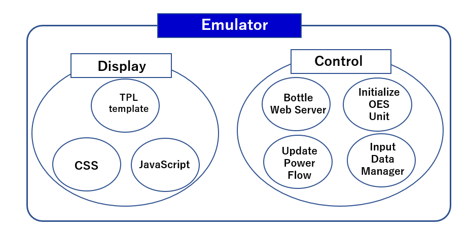

**apis-emulator Specification Document**

**Rev 0.60**

# **Contents**
- [**Contents**](#contents)
- [**1. Terms and abbreviations**](#1-terms-and-abbreviations)
- [**2. Overview**](#2-overview)
- [**3. Software configuration**](#3-software-configuration)
  - [**3.1. Software overview**](#31-software-overview)
  - [**3.2. Software connection configuration**](#32-software-connection-configuration)
- [**4. Functions**](#4-functions)
  - [**4.1. Display**](#41-display)
  - [**4.2. Controller**](#42-controller)
    - [**4.2.1. Bottle Web Server**](#421-bottle-web-server)
    - [**4.2.2. Initialize OES Unit**](#422-initialize-oes-unit)
    - [**4.2.3. Input Data Manager**](#423-input-data-manager)
    - [**4.2.4. Update Power Flow**](#424-update-power-flow)
- [**5. Communication specfications**](#5-communication-specfications)
  - [**5.1. User – Emulator Web API**](#51-user--emulator-web-api)
  - [**5.2. apis-main – Emulator Web API**](#52-apis-main--emulator-web-api)
- [**6. Power storage system data**](#6-power-storage-system-data)
  - [**6.1. Parameters**](#61-parameters)
- [**7. Configuration file**](#7-configuration-file)
  - [**7.1. config.py**](#71-configpy)
  - [**7.2. config/logging.conf**](#72-configloggingconf)
- [**8. Log output**](#8-log-output)
  - [**8.1. Log Level**](#81-log-level)
  - [**8.2. Log output destination**](#82-log-output-destination)
- [**9. Sample data for solar radiation and household power consumption**](#9-sample-data-for-solar-radiation-and-household-power-consumption)
- [**10. Handling of abnormalities**](#10-handling-of-abnormalities)
- [**11. Security**](#11-security)
  - [**11.1. User-Emulator communication security**](#111-user-emulator-communication-security)
  - [**11.2. apis-main-Emulator communication security**](#112-apis-main-emulator-communication-security)
- [**12. Privacy**](#12-privacy)
- [**13. OSS licensing**](#13-oss-licensing)

 

# **1. Terms and abbreviations**

| **Term**  | **Explanation**                                                                                 |
| --------- | ----------------------------------------------------------------------------------------------- |
| apis-main | Software for energy sharing developed by Sony CSL that enables autonomous decentralized control |
| EMU       | Energy Management Unit: A device for controlling a power storage system.                        |

 

# **2. Overview**

The Emulator runs a computer emulation that reproduces the hardware system for energy sharing, including the battery system and the DC/DC converter, etc. The Emulator reads in data on the amount of solar radiation and the power consumption of residences and emulates the flow of energy such as the power generated and consumed by multiple residences, and battery system charging and discharging. The emulation conditions can be changed in real time by using a Web browser to access and change the hardware parameters. There is also a function for communication with apis-main, which reads storage battery data from the hardware emulation on the computer and operates the DC/DC converter to emulate energy sharing.

  
Figure 2-1

 

# **3. Software configuration**
    
## **3.1. Software overview**

The Emulator software comprises a display module and a control module (Figure 3-1). The display module has a standard configuration, with the content structure defined by TPL templates, styled with CSS, and dynamic elements added with JavaScript. Those tools are used to construct browser screens that enable user access via the browser. For the controller module, the Python Bottle framework for creating Web apps is used to set up a Web server and Web API to enable access to processing by apis-main and the user. The Update Power Flow component is a computer emulation of the flow of power, including solar power generation, residential power consumption, and battery system charging and discharging, etc. The Input Data Manager component reads data such as amount of solar radiation and power demand data such as residential power consumption that is required for the emulation from a file in CSV format. The Initialize OES Unit component reads the parameters that are required for constructing the power storage system environment from a file in JSON format.  

  
Figure 3-1

 　

## **3.2. Software connection configuration**

In the Emulator software connection configuration (Figure 3-2), user requests to Emulator via Web API and the request is received by the Bottle Web server. If the request is for display of the Emulator screen, the corresponding TPL template, CSS file, and JavaScript file are downloaded from the display module to the browser and the page is displayed. For other requests, the server collects the required information and returns it to the user. The Input Data Manager of the controller module reads the data required for emulation (amounts solar radiation and residential power consumption etc.) from a CSV file and stores it in variables and arrays. The Update Power Flow component uses the data compiled by Input Data Manager to emulate power flow, including power generation per unit time and power consumption, including hardware power loss, as well as the charging and discharging of the power storage system. The apis-main Controller Service communicates with the hardware environment generated on the computer via the Bottle Web Server Web API. Specifically, the battery system state of charge is obtained and the DC/DC Converter is controlled to implement mock energy sharing.  

  
Figure 3-1

 

# **4. Functions**
    
## **4.1. Display**

The Emulator screen presents information on the three power storage systems generated on the computer, E001, E002, and E003 (Figure 4-1). The number of power storage systems that can be displayed depends on the number of households for which power consumption data is read from the CSV file and the performance of the computer on which Emulator is running. If the Auto Refresh checkbox in the upper left corner of the screen is checked, the data for each power storage system is updated according to the emulation results.

  
Figure 4-1  

The checkbox and buttons at the top of the screen shown in Figure 4-1 are explained below.

\[Auto Refresh checkbox\]  
Checked: The displayed power storage system data is updated according to the emulation results every five seconds.  
Not checked: The displayed data is not updated.

\[Read All button\]  
Clicking this button updates all of the displayed power storage system data based on the emulation results.

\[Set All button\]  
Clicking this button enables values for the items listed below to be entered to replace the current settings.  
* Charge discharge power
* rsoc
* ups output power
* pvc charge power
* Powermeter all
* Powermeter p2
* Status
* Grid current
* Grid voltage
* Droop ratio  

The entered values immediately replace the emulation parameters for all of the power storage systems. (For an explanation of the parameters, see Figure 4-2 and Figure 4-3.)

\[Save All button\]  
This saves the parameters for all of the power storage systems in the emulation in the file jsontmp/lastSave.json. (Concerning the parameters that are saved, see section 6.1, “Parameters”.)

\[Load Last button\]  
This reads the parameter values for all of the power storage systems from the jsontmp/lastSave.json file and uses them to replace the current emulation parameters.

\[Reset button\]  
This reads the parameter values for all of the power storage systems from the jsontmp/fakeResponse.json file and uses them to replace the current emulation parameters. In doing so, required parameters are initialized.

\[Add Unit button\]  
This adds one power storage system unit to the emulation each time it is clicked.  
The power storage system ID is a serial number that is assigned when a unit is added. The serial number is incremented by one each time a unit is added. (For example, if E006 is the ID of the previously added unit, E007 will be assigned to the next unit that is added.)  
When a unit is added, the default parameters are read from the jsontmp/standard.json file to initialize the required parameters.

\[Remove Unit button\]  
This removes one power storage unit each time it is clicked.  
Units are removed in order of highest assigned ID number.

\[Set Acceleration Rate button\]  
This factor is used to change the progression of time in the emulation according to the number that is set in the field to the right of this button. (For example, if the number is set to 10, time in the emulation progresses 10 seconds for each second in the real world.)  
The buttons in the individual power storge system information are explained below.

\[Read\]  
This updates the information of the power storage system for which the button was clicked to the emulation result for the time at which the button was clicked.

\[Set\]  
This replaces the emulation parameters with the values that are entered for the power storage system for which the button was clicked at the time the button was clicked. (For the parameters entered, see the explanation for the \[Set All button\].)  
 
The information for a power storage system emulation created by Emulator is illustrated in Figure 4-2.

  
Figure 4-2  
 
The Emulator information display for the power storage system alone is shown in Figure 4-3. Each item of information is explained below. (The numbers assigned in Figure 4-2 and Figure 4-3 are the same as the numbers in the following explanation.)  
  
Figure 4-3

1.  Charge-discharge power  
   The charge-discharge power of the power storage system \[W\] (absolute value)

2.  rsoc  
   Storage battery relative state of charge \[%\]

3.  ups output power  
   UPS output power \[W\] (corresponds to the residential power consumption)

4.  pvc charge power  
   Power output of the PVC \[W\]

5.  Powermeter all  
   Power consumption for the power storage system and residence \[W\]

6.  Powermeter p2  
   Power consumption of the power storage system \[W\]

7.  Status  
   Status of the DC/DC converter

8.  Grid current  
   DC Grid maximum current \[A\]

9.  Grid voltage  
    DC Grid target voltage \[V\]

10. Droop ratio  
    DC Grid droop rate \[%\]

11. Grid power  
    ⑫ Grid current x ⑬ Grid voltage \[W\]

12. Grid current  
    DC Grid current \[A\]

13. Grid voltage  
    DC Grid voltage \[V\]

14. Battery power  
    ⑮ Battery current x ⑯ Battery voltage \[W\]

15. Battery current  
    The storage battery current \[A\]

16. Battery voltage  
    The storage battery voltage \[V\]

17. Battery Status  
    ② Battery relative state of charge \[%\]

18. Operating power  
    DC/DC Converter loss \[W\]

 

## **4.2. Controller**
    
### **4.2.1. Bottle Web Server**

Bottle is a Web server that performs various kinds of processing when it receives Web API requests from the user, apis-main, or a JavaScript script. The server IP address and port number are specified in the config.py file. (For more information, see section 7.1, “config.py”.

 

### **4.2.2. Initialize OES Unit**

This reads the parameters required for constructing the power storage system environment from the jsontmp/standard.json file, changes the UnitID and other parameters that require individual changing, and stores the values in an array. The number of power storage systems to be generated on the computer is either passed in as the first parameter when invoking the Emulator or is determined by the number of displayNames registered in global\_var.py.

 

### **4.2.3. Input Data Manager**

This reads the solar radiation and residence power consumption data from the CSV files under data/input/Sample for use in the emulation. The samples include hourly solar radiation amounts for 365 days and residential power consumption per hour for 100 households for 365 days. The data that is read is stored in arrays.

 

### **4.2.4. Update Power Flow**

The process described by steps (1) to (4) below is executed repeatedly by Emulator for computer emulation of the flow of power for a power storage system, including solar power generation, residential power consumption, and battery charging and discharging.

1)  Change the UPS operation mode according to the state of charge of the battery. If the state of charge is low, change the mode to bypass and charge the battery from the grid.

2)  Calculate the power for charging or discharging the battery from the power loss of the power storage system and the power generation and consumption, and update.

3)  Advance the emulation world time according to the value set by the “Set Acceleration Rate button”. (For more information, see section 4.1, “Display module”.)

4)  Calculate the values for solar power generation and residential power consumption over the time specified in step (3) and update the battery state of charge value.

 

# **5. Communication specfications**
    
## **5.1. User – Emulator Web API**

The user performs browser operations to access Emulator via the Web API for information exchange. The Web API specifications are explained below.

<table>
<tbody>
<tr class="odd">
<td>/</td>
<td>Present the screen for displaying or setting the parameters for all of the power storage systems in the emulation.</td>
</tr>
<tr class="even">
<td>/restart</td>
<td>For the processing, see section 4.1, “Display module”, [Reset button].</td>
</tr>
<tr class="odd">
<td>/add/unit</td>
<td>For the processing, see section 4.1, “Display module”, [Add Unit button].</td>
</tr>
<tr class="even">
<td>/remove/unit</td>
<td>For the processing, see section 4.1, “Display module”, [Remove Unit button].</td>
</tr>
<tr class="odd">
<td>/get/log</td>
<td>Get the parameters for all of the power storage systems in the emulation. (For more information, see section 6.1, “Power storage system parameters”.)</td>
</tr>
<tr class="even">
<td>/get/last</td>
<td>For the processing, see section 4.1, “Display module”, [Load Last button].</td>
</tr>
<tr class="odd">
<td>/save</td>
<td>For the processing, see section 4.1, “Display module”, [Save All button].</td>
</tr>
<tr class="even">
<td>/get/emu/<oesid\></td>
<td>Get the EMU parameters for the power storage system specified by <oesid\>.</td>
</tr>
<tr class="odd">
<td>/get/acc </td>
<td>Get the time acceleration rate of the emulation world.</td>
</tr>
<tr class="even">
<td>/set/acc/<newacc\></td>
<td>Set the time acceleration rate of the emulation world to the value specified by <newacc\>. For the processing, see section 4.1, “Display module”, [Set Acceleration Rate button].</td>
</tr>
<tr class="odd">
<td>/set/emu/<oesid\></td>
<td>Set the values specified by the query parameters as the EMU parameters for the power storage system specified by <oesid\>.</td>
</tr>
</tbody>
</table>

 

## **5.2. apis-main – Emulator Web API**

The apis-main performs browser operations to access Emulator via the Web API for information exchange. The Web API specifications are explained below.

<table>
<tbody>
<tr class="even">
<td>/get/unit/&lt;oesid&gt;</td>
<td>
Get the parameters for the power storage system specified by &lt;oesid&gt;.

(The parameters that can be obtained are the same as for /get/log.)
</td>
</tr>
<tr class="odd">
<td>/get/dcdc/status/&lt;oesid&gt;</td>
<td>Of the DC/DC Converter parameters for the power storage system specified by &lt;oesid&gt;, get only the status.</td>
</tr>
<tr class="even">
<td>/get/dcdc/&lt;oesid&gt;</td>
<td>Get all of the DC/DC Converter parameters for the power storage system specified by &lt;oesid&gt;.</td>
</tr>
<tr class="odd">
<td>/set/dcdc/&lt;oesid&gt;</td>
<td>Set the values specified by the query parameters as the DC/DC Converter parameters for the power storage system specified by &lt;oesid&gt;.</td>
</tr>
<tr class="even">
<td>/set/dcdc/voltage/&lt;oesid&gt;</td>
<td>Set the value specified by the query parameter as the DC/DC Converter voltage parameter for the power storage system specified by &lt;oesid&gt;.</td>
</tr>
<tr class="odd">
<td>/set/dcdc/current/&lt;oesunit&gt;</td>
<td>Set the value specified by the query parameter as the DC/DC Converter current parameter for the power storage system specified by &lt;oesid&gt;.</td>
</tr>
</tbody>
</table>

 

# **6. Power storage system data**
    
## **6.1. Parameters**

The power storage system information available to the user from the Web API “/get/log” endpoint is explained below. That information is collected as one set for all of the power storage system.

(The default parameters used when the power storage system is constructed are specified in the jsontmp/standard.json file.)

<table>
<tbody>
<tr class="even">
<td rowspan="24">emu</td>
<td>charge_discharge_power</td>
<td>Battery charge/discharge power [W] (absolute)</td>
</tr>
<tr class="odd">
<td>rsoc</td>
<td>The battery relative state of charge (%) that is used for display and control.</td>
</tr>
<tr class="even">
<td>battery_rsoc</td>
<td>The relative state of charge (%) of a real battery</td>
</tr>
<tr class="odd">
<td>battery_voltage</td>
<td>Battery voltage [V]</td>
</tr>
<tr class="even">
<td>battery_current</td>
<td>Battery current [A]</td>
</tr>
<tr class="odd">
<td>pvc_charge_voltage</td>
<td>PVC output voltage [V]</td>
</tr>
<tr class="even">
<td>pvc_charge_current</td>
<td>PVC output current [A]</td>
</tr>
<tr class="odd">
<td>pvc_charge_power</td>
<td>PVC output power [W]</td>
</tr>
<tr class="even">
<td>ups_input_voltage</td>
<td>UPS input voltage [V]</td>
</tr>
<tr class="odd">
<td>ups_output_voltage</td>
<td>UPS output voltage [V]</td>
</tr>
<tr class="even">
<td>ups_output_current</td>
<td>UPS output current [A]</td>
</tr>
<tr class="odd">
<td>ups_output_power</td>
<td>UPS output power [W]</td>
</tr>
<tr class="even">
<td>ups_output_frequency</td>
<td>UPS output frequency [Hz]</td>
</tr>
<tr class="odd">
<td>ups_operation_mode.parameter</td>
<td>Proportion of grid power use</td>
</tr>
<tr class="even">
<td>ups_operation_mode.mode</td>
<td>UPS operation mode</td>
</tr>
<tr class="odd">
<td>ups_operation_mode.stop_mode</td>
<td>
UPS operation mode after the battery has been depleted

<ol type="1">
<li>
UPS; 2. Bypass
</li>
</ol></td>
</tr>
<tr class="even">
<td>ups_operation_schedule</td>
<td>UPS operation schedule</td>
</tr>
<tr class="odd">
<td>system_time.year</td>
<td>The year in the EMU system clock</td>
</tr>
<tr class="even">
<td>system_time.month</td>
<td>The month in the EMU system clock</td>
</tr>
<tr class="odd">
<td>system_time.day</td>
<td>The day in the EMU system clock</td>
</tr>
<tr class="even">
<td>system_time.hour</td>
<td>The hour in the EMU system clock</td>
</tr>
<tr class="odd">
<td>system_time.minute</td>
<td>The minute in the EMU system clock</td>
</tr>
<tr class="even">
<td>dischargeable_time.hour</td>
<td>Hours for which battery discharge is possible</td>
</tr>
<tr class="odd">
<td>dischargeable_time.minute</td>
<td>Minutes for which battery discharge is possible</td>
</tr>
<tr class="even">
<td rowspan="27">dcdc</td>
<td>status.status</td>
<td>DC/DC Converter status</td>
</tr>
<tr class="odd">
<td>status.statusName</td>
<td>DC/DC Converter status information</td>
</tr>
<tr class="even">
<td>status.alarm</td>
<td>DC/DC Converter alarm number</td>
</tr>
<tr class="odd">
<td>status.stateAlarm</td>
<td>DC/DC Converter alarm information</td>
</tr>
<tr class="even">
<td>status.runningState</td>
<td>DC/DC Converter operation status</td>
</tr>
<tr class="odd">
<td>status.operationMode</td>
<td>Operation mode status</td>
</tr>
<tr class="even">
<td>powermeter.p1</td>
<td>
Power consumption of the power storage system and residence [W]

(For more information, see Figure 4-2.)
</td>
</tr>
<tr class="odd">
<td>powermeter.p2</td>
<td>
Power consumption to the power storage system [W]

(For more information, see Figure 4-2.)
</td>
</tr>
<tr class="even">
<td>powermeter.v1</td>
<td>The voltage at powermeter.p1 [V]</td>
</tr>
<tr class="odd">
<td>powermeter.i1</td>
<td>The current at powermeter.p1 [A]</td>
</tr>
<tr class="even">
<td>powermeter.kwh1</td>
<td>The power at powermeter.p1 [kWh]</td>
</tr>
<tr class="odd">
<td>powermeter.kwh2</td>
<td>The power at powermeter.p2 [kWh]</td>
</tr>
<tr class="even">
<td>meter.vg</td>
<td>DC Grid voltage (V)</td>
</tr>
<tr class="odd">
<td>meter.ig</td>
<td>DC Grid current (A)</td>
</tr>
<tr class="even">
<td>meter.wg</td>
<td>DC Grid power (W)</td>
</tr>
<tr class="odd">
<td>meter.vb</td>
<td>Battery voltage (V)</td>
</tr>
<tr class="even">
<td>meter.ib</td>
<td>Battery current (A)</td>
</tr>
<tr class="odd">
<td>meter.wb</td>
<td>Battery power (W)</td>
</tr>
<tr class="even">
<td>meter.tmp</td>
<td>Internal temperature (℃)</td>
</tr>
<tr class="odd">
<td>vdis.dvg</td>
<td>DC Grid target voltage (V)</td>
</tr>
<tr class="even">
<td>vdis.drg</td>
<td>DC Grid Droop rate (%)</td>
</tr>
<tr class="odd">
<td>param.dig</td>
<td>DC Grid maximum current (A)</td>
</tr>
<tr class="even">
<td>param.ogv</td>
<td>DC Grid overvoltage threshold (V)</td>
</tr>
<tr class="odd">
<td>param.ugv</td>
<td>DC Grid low voltage threshold (V)</td>
</tr>
<tr class="even">
<td>param.cib</td>
<td>Battery maximum current (A)</td>
</tr>
<tr class="odd">
<td>param.obv</td>
<td>Battery overvoltage threshold (V)</td>
</tr>
<tr class="even">
<td>param.ubv</td>
<td>Battery low voltage threshold (V)</td>
</tr>
<tr class="odd">
<td rowspan="9">oesunit</td>
<td>on</td>
<td>
Parameters used by the previous control system

Not used by the APIS Emulator
</td>
</tr>
<tr class="even">
<td>ip</td>
<td>IPv4 Address of APIS installed devices</td>
</tr>
<tr class="odd">
<td>display</td>
<td>Information displayed on the power storage system screen</td>
</tr>
<tr class="even">
<td>ipv6_ll</td>
<td>IPv6 link local address for APIS installed devices</td>
</tr>
<tr class="odd">
<td>ipv6_g</td>
<td>IPv6 global address for APIS installed devices</td>
</tr>
<tr class="even">
<td>mac</td>
<td>MAC address for APIS installed devices</td>
</tr>
<tr class="odd">
<td>sn</td>
<td>Serial number for APIS installed devices</td>
</tr>
<tr class="even">
<td>id</td>
<td>The power storage system ID</td>
</tr>
<tr class="odd">
<td>budo</td>
<td>
Parameters used by the previous control system

Not used by the APIS Emulator
</td>
</tr>
<tr class="even">
<td>time</td>
<td>apis-main node time</td>
<td>The time for the power storage system on the Emulator</td>
</tr>
</tbody>
</table>

 

# **7. Configuration file**
    
## **7.1. config.py**

This file contains the parameters that have been set for running the emulation.

<table>
<tbody>
<tr class="even">
<td>debug</td>
<td>
A flag for selecting whether or not debugging messages are output

True: Debugging messages are output.

False: Debugging messages are not output.
</td>
</tr>
<tr class="odd">
<td>dataSet</td>
<td>A data set such as residential power consumption or amount of solar radiation</td>
</tr>
<tr class="even">
<td>sleeptime</td>
<td>The wait time between Update Power Flow loops</td>
</tr>
<tr class="odd">
<td>doUpdates</td>
<td>
Flag for selecting whether or not the emulation is run

True: The emulation is run.

False: The mock hardware environment is constructed, but power flow emulation, etc. is not run.
</td>
</tr>
<tr class="even">
<td>saveIndividualToDB</td>
<td>
Flag for selecting whether or not the power storage system parameters are to be stored in a database (DB)

True: Store in DB

False: Do not store in DB
</td>
</tr>
<tr class="odd">
<td>saveToSummaryToCSV</td>
<td>
Flag for selecting whether or not the data for power consumption and power flow, etc. is to be summarized and saved to a CSV file

True: Save as CSV

False: Do not save as CSV
</td>
</tr>
<tr class="even">
<td>saveIndividualToCSV</td>
<td>
A flag for selecting whether or not the power system parameters are to be saved to a CSV file

True: Save as CSV

False: Do not save as CSV
</td>
</tr>
<tr class="odd">
<td>constantSystemLoss</td>
<td>Power system constant loss</td>
</tr>
<tr class="even">
<td>DCCstLoss</td>
<td>DC/DC Converter constant loss</td>
</tr>
<tr class="odd">
<td>DCChargeLoss</td>
<td>DC/DC Converter charging loss</td>
</tr>
<tr class="even">
<td>DCDischargeLoss</td>
<td>DC/DC Converter discharging loss</td>
</tr>
<tr class="odd">
<td>battModeLoss_a</td>
<td>
Loss relative to load for UPS battery mode

　(loss = battModeLoss_a x load)
</td>
</tr>
<tr class="even">
<td>battModeLoss_c</td>
<td>Constant loss in UPS battery mode</td>
</tr>
<tr class="odd">
<td>transLoss_a</td>
<td>Transformer loss relative to load for UPS battery mode (loss = transLoss_a x load)</td>
</tr>
<tr class="even">
<td>transLoss_c</td>
<td>Transformer constant loss for UPS battery mode</td>
</tr>
<tr class="odd">
<td>bypassModeLoss_a</td>
<td>
Loss relative to load for UPS bypass mode

(loss = transLoss_a x load)
</td>
</tr>
<tr class="even">
<td>bypassModeLoss_c</td>
<td>Constant loss for UPS bypass mode</td>
</tr>
<tr class="odd">
<td>ACChargeLoss</td>
<td>Loss for charging with grid power (Powermeter.p2)</td>
</tr>
<tr class="even">
<td>UPS_TRIGGER_BATT_OFF</td>
<td>A UPS setting for the threshold battery RSOC value below which supply from the battery is set to OFF</td>
</tr>
<tr class="odd">
<td>UPS_TRIGGER_BATT_ON</td>
<td>A UPS setting for the threshold battery RSOC value above which supply from the battery is set to ON</td>
</tr>
<tr class="even">
<td>UPS_TRIGGER_AC_OFF</td>
<td>A UPS setting for the threshold battery RSOC value above which supply from the grid to the battery is set to OFF</td>
</tr>
<tr class="odd">
<td>UPS_TRIGGER_AC_ON</td>
<td>A UPS setting for the threshold battery RSOC value below which supply from the grid to the battery is set to ON</td>
</tr>
<tr class="even">
<td>batteryVoltage</td>
<td>Battery voltage</td>
</tr>
<tr class="odd">
<td>ACChargeAmount</td>
<td>Limit for charging from grid power</td>
</tr>
<tr class="even">
<td>default_Area</td>
<td>PV panel area</td>
</tr>
<tr class="odd">
<td>r</td>
<td>PV panel conversion efficiency</td>
</tr>
<tr class="even">
<td>pr</td>
<td>
PV panel performance factors

Factors other than panel area and conversion efficiency that affect power generation, such as panel inclination angle, are represented collectively as a single variable.
</td>
</tr>
<tr class="odd">
<td>batterySize</td>
<td>The power storage battery capacity</td>
</tr>
<tr class="even">
<td>pvc_sol_reg</td>
<td>The PV size for each power storage system</td>
</tr>
<tr class="odd">
<td>dburl</td>
<td>The database URL</td>
</tr>
<tr class="even">
<td>summaryPath</td>
<td>This specifies the location for saving the saveToSummaryToCSV data.</td>
</tr>
<tr class="odd">
<td>indivLogPath</td>
<td>This specifies the location for saving the saveIndividualToCSV data.</td>
</tr>
<tr class="even">
<td>b_host</td>
<td>Bottle Web Server IP Address</td>
</tr>
<tr class="odd">
<td>b_port</td>
<td>Bottle Web Server port number</td>
</tr>
<tr class="even">
<td>modes</td>
<td>
DC/DC Converter status

&quot;0x0000&quot;: 'Waiting',

&quot;0x0002&quot;: 'Heteronomy CV Discharging',

&quot;0x0014&quot;: 'Grid Autonomy Mode',

&quot;0x0041&quot;: 'Heteronomy CV Charging - grid current limited'
</td>
</tr>
<tr class="odd">
<td>modesOps</td>
<td>
The DC/DC Converter operating mode status

&quot;0x0000&quot;: 'Waiting',

&quot;0x0002&quot;: 'Heteronomy CV',

&quot;0x0014&quot;: 'Grid Autonomy',

&quot;0x0041&quot;: 'Heteronomy CV'
</td>
</tr>
<tr class="even">
<td>modesRunning</td>
<td>
The DC/DC Converter running status

&quot;0x0000&quot;: 'off',

&quot;0x0002&quot;: 'discharge',

&quot;0x0014&quot;: 'discharge',

&quot;0x0041&quot;: 'charge'
</td>
</tr>
</tbody>
</table>

The formula for calculating amount of generated power from the amount of solar radiation read from the CSV is shown below.  
> Generated power = Amount of solar power (CSV) x PV panel area (default\_Area) x PV panel conversion efficiency (ｒ) x PV panel performance factor (pr)

 

## **7.2. config/logging.conf**

Emulator uses the logging.config.fileConfig() method to initialize Logger. When invoked, that method reads the logging.conf file and uses pre-set values from the file to initialize Logger.

<table>
<tbody>
<tr class="even">
<td>loggers</td>
<td>keys: Logger instance name description</td>
</tr>
<tr class="odd">
<td>handlers</td>
<td>keys: Handler instance name description</td>
</tr>
<tr class="even">
<td>formatters</td>
<td>keys: Formatter instance name description</td>
</tr>
<tr class="odd">
<td>loger_root</td>
<td>
level: Specifies the message output level

handlers: Specifies the applicable handler instance name
</td>
</tr>
<tr class="even">
<td>
handler_consoleHandler

handler_infoFileHandler
</td>
<td>
class: Specification of the implemented Handler class

-StreamHandler: Outputs the specified stream

-FileHandler: Outputs the specified file

level: Outputs messages of the specified level or higher level

formatter: The name of the Formatter used for message output

args: The arguments used to instantiate Handler

Set the Log output destination and folder for storing the Log file
</td>
</tr>
<tr class="odd">
<td>
formatter_consoleFormatter

formatter_infoFileFormatter
</td>
<td>
format: Specifies various formats

datefmt: Specifies the date format
</td>
</tr>
</tbody>
</table>

 

# **8. Log output**
    
## **8.1. Log Level**

Log output uses the Python “logging” standard library module, which has the five output levels described below. The “critical” level is not used for Emulator. The destination for log output, the location of the folder in which log files are saved, and the log level for output or saving are specified as settings in the logging.conf file.

\[Level\]  
1.  CRITICAL  
   → Indicates that a fatal problem has occurred, but this level is not output for Emulator.

1.  ERROR  
   → Indicates that a problem has occurred during execution.  
   \<Example\> When input information cannot be read from a CSV file, etc.

1.  WARNING  
   → Used for alert notifications  
   \<Example\> When parameters specified by the Web API are missing, etc.

1.  INFO  
   → Used to output information on a normally-operating system.  
   \<Example\> Notification of behavioral information, such as “ramping up finish”.

1.  DEBUG  
   → Information used for debugging.  
   \<Example\> Information used for debugging the Emulator, etc.

 

## **8.2. Log output destination**

Emulator logs are output to a file. The log output destinations can be enabled or disabled and the log output level can be restricted by changing the settings in the logging.conf file as explained in the previous section.

 

# **9. Sample data for solar radiation and household power consumption**

The data for solar radiation and residential power consumption that is used in emulation is read from the respective CSV files located under data/input/Sample. Emulations can be run for various solar radiation and power consumption conditions by replacing the data in the CSV files.

The data format is shown below.  
* Amount of solar radiation  
 For each row, enter values for the hourly amount of solar radiation for 24 hours, beginning at 0:00 (a set of 24 data points). Enter data rows for 365 days. \[unit: W/m2\]  
 (For more information, refer to “data/input/Sample/sample\_solar\_data.csv”.)

* Residential power consumption  
 For each row, enter values for residence power consumption for every 30 minutes for 24 hours, beginning at 0:00 (a set of 48 data points). Enter data rows for 365 days to create a data set for one household. Create data sets for 100 households, continuing in the column direction. \[unit: kW\]  
 (For more information, refer to “data/input/Sample/sample\_load\_data.csv”.)

 

# **10. Handling of abnormalities**

A log is output to a file when an abnormality occurs, but there is no function for the system to reset or stop itself.

 

# **11. Security**
    
## **11.1. User-Emulator communication security**

Communication between User and Emulator is not secured, so Web server configuration for IP address access restriction may be necessary.

 

## **11.2. apis-main-Emulator communication security**

Communication between apis-main and Emulator is not secured, so Web server configuration for IP address access restriction may be necessary.

 

# **12. Privacy**

All of the information that can be obtained from the Emulator is generated mock data, so there is no association with personal data.

 

# **13. OSS licensing**

The software used by Emulator and the corresponding OSS license information are described below.

■Emulator software and licensing information

<table>
<thead>
<tr class="header">
<th>Software</th>
<th>Version</th>
<th>License</th>
<th>Code Change</th>
</tr>
</thead>
<tbody>
<tr class="odd">
<td>python</td>
<td>3.6.9</td>
<td>PSL License</td>
<td>None</td>
</tr>
<tr class="even">
<td>gevent</td>
<td>20.9.0</td>
<td>MIT License</td>
<td>None</td>
</tr>
<tr class="odd">
<td>requests</td>
<td>2.24.0</td>
<td>Apache License2.0</td>
<td>None</td>
</tr>
<tr class="even">
<td>pandas</td>
<td>0.25.3</td>
<td>BSD License</td>
<td>None</td>
</tr>
<tr class="odd">
<td>bottle</td>
<td>0.12.8</td>
<td>MIT License</td>
<td>None</td>
</tr>
<tr class="even">
<td>netifaces</td>
<td>0.10.9</td>
<td>MIT License</td>
<td>None</td>
</tr>
<tr class="odd">
<td>wheel</td>
<td>0.30.0</td>
<td>MIT License</td>
<td>None</td>
</tr>
<tr class="even">
<td>jQuery</td>
<td>1.7.2</td>
<td>
MIT License or GPL v2 License

(selectable)
</td>
<td>None</td>
</tr>
</tbody>
</table>

\*Software versions may change.
