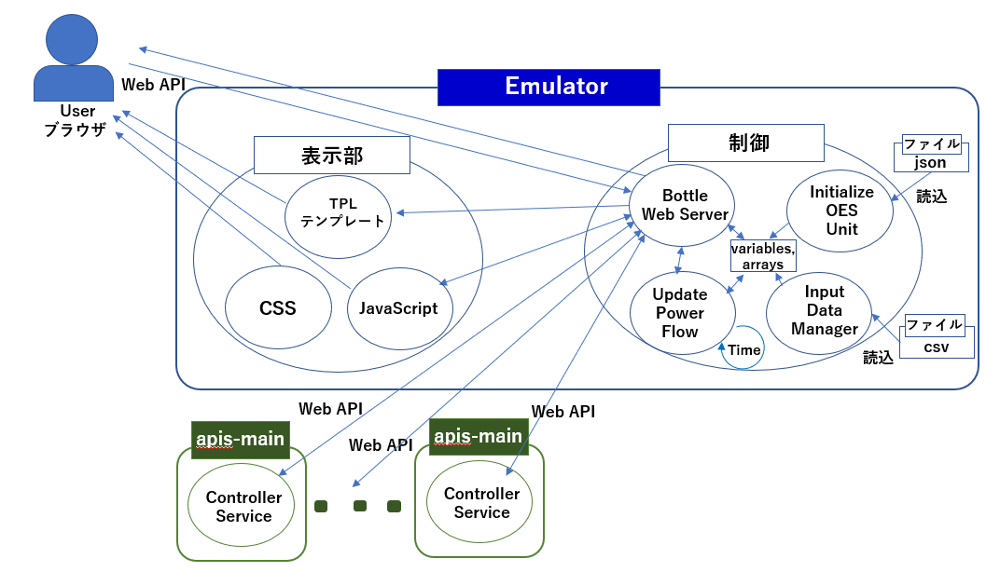

**apis-emulator仕様書**
========================
**Rev 0.60**

**目次**
========

[1.用語・略語](#anchor1)

[2.概要](#anchor2)

[3.ソフトウェア構成](#anchor3)

&emsp;[3.1ソフトウェア概要](#anchor3-1)

&emsp;[3.2.ソフトウェア接続構成](#anchor3-2)

[4.機能説明](#anchor4)

&emsp;[4.1.表示部](#anchor4-1)

&emsp;[4.2.制御部](#anchor4-2)

&emsp;&emsp;[4.2.1.Bottle Web Server](#anchor4-2-1)

&emsp;&emsp;[4.2.2.Initialize OES Unit](#anchor4-2-2)

&emsp;&emsp;[4.2.3.Input Data Manager](#anchor4-2-3)

&emsp;&emsp;[4.2.4.Update Power Flow](#anchor4-2-4)

[5.通信仕様](#anchor5)

&emsp;[5.1.User – Emulator間Web API](#anchor5-1)

&emsp;[5.2.apis-main – Emulator間Web API](#anchor5-2)

[6.蓄電システム情報](#anchor6)

&emsp;[6.1.蓄電システムパラメータ](#anchor6-1)

[7.設定ファイルについて](#anchor7)

&emsp;[7.1.config.py](#anchor7-1)

&emsp;[7.2.config/logging.conf](#anchor7-2)

[8.Log出力](#anchor8)

&emsp;[8.1.Log Level](#anchor8-1)

&emsp;[8.2.Log出力先](#anchor8-2)

[9.日射量及び住宅の消費電力量サンプルデータ](#anchor9)

[10.異常処理](#anchor10)

[11.セキュリティ](#anchor11)

&emsp;[11.1.User-Emulator間通信セキュリティ](#anchor11-1)

&emsp;[11.2.apis-main-Emulator間通信セキュリティ](#anchor11-2)

[12.プライバシー](#anchor12)

[13.OSSライセンス](#anchor13)

**1.用語・略語**
==============

<table><thead><tr class="header"><th><strong>用語</strong></th><th><strong>説明</strong></th></tr></thead><tbody><tr class="odd"><td>apis-main</td><td>
自律分散制御を可能にするSony CSLが開発した電力相互融通ソフトウェアである。(詳細はapis-main仕様書を参照。)
</td></tr><tr class="even"><td>EMU</td><td>Energy Management Unit : 蓄電システムを制御するデバイスである。</td></tr></tbody></table>

**2.概要**
========

Emulatorは蓄電池や電力融通用DC/DC Converter等を含んだハードウェア環境をコンピュータ上で再現し、日射量と住宅の消費電力量情報を読み込み、複数の住宅の発電と消費、蓄電池の充放電等の電力の流れをエミュレーションすることが可能である。さらにブラウザからEmulatorにアクセスすることで再現されたハードウェア環境のパラメータを容易に変更することができるため、リアルタイムに条件を変えてエミュレーションを実施することが可能である。また、apis-mainとの通信機能も有しており、apis-mainはコンピュータ上で再現されたハードウェア環境から蓄電池の情報を読み取ったりDC/DC Converterを操作したりして電力融通のエミュレーションを行うことが可能である。

図2-1

**3.ソフトウェア構成**
====================

**3.1.ソフトウェア概要**
-----------------------

Emulatorのソフトウェア構成としては以下の図3-1で示すように表示部と制御部に分けることができる。表示部に関しては標準的な構成ではあるが、TPLテンプレートでWebコンテンツの構造を作成し、CSSにて飾り付けを行ってJavaScriptで画面に動きを持たせており、これらの機能を使ってUserのブラウザからのアクセスに対して画面を構築している。制御部に関してはWebアプリケーション作成用フレームワークであるPython Bottleを使用してWeb Serverを立てapis-mainやUserからのWeb APIアクセスに対して処理を行っている。Update Power Flowはコンピュータ上で生成された蓄電システム上で太陽光発電、住宅の消費、蓄電池への充放電等の電力の流れ等をエミュレーションする。Input Data Managerはエミュレーションに必要な日射量や住宅の消費電力量のデマンド等が記載されたCSVファイルを、Initialize OES Unitは蓄電システムの環境構築に必要なパラメータが記載れたJSONファイルをそれぞれ読み込み込みUpdate Power Flowにそれらの情報を渡す。

&emsp;&emsp;&emsp;&emsp;&emsp;&emsp;&emsp;&emsp;&emsp;&emsp;&emsp;&emsp;&emsp;&emsp;&emsp; &emsp;&emsp;&emsp; &emsp;&emsp;&emsp;図3-1

**3.2ソフトウェア接続構成**
------------------------

Emulatorのソフトウェア接続構成を以下の図3-2に示す。UserがEmulatorへWeb APIアクセスを行うと制御部のBottle Web Serverがそのリクエストを受け取る。UserからのリクエストがEmulator画面の表示だった場合には、表示部のTPLテンプレート、CSS、JavaScriptがUser側のブラウザにダウンロードされて画面が表示される。また、画面表示ではないリクエストの場合にはBottle Web Serverが必要な情報を集めてUserへ返す。制御部のInput Data Managerはエミュレーションに必要な日射量や住宅の消費電力量等の情報をCSVファイルから読み込み、変数や配列に情報を格納する。Update Power FlowはInput Data Managerが作成した情報を元に時間経過毎の発電やハードウェア環境の電力ロスを含めた消費、蓄電池への充放電の電力の流れ等をエミュレーションする。apis-mainのController ServiceはWeb APIを使用しBottle Web Server経由で、コンピュータ上に生成されたハードウェア環境と通信を行う。具体的には生成された蓄電池の残容量を取得し、DC/DC Converterを制御して疑似的な電力融通を実現する。

図3-2

**4.機能説明**
==============

**4.1.表示部**
----------

図4-1にEmulatorの画面を示す。 図はE001, E002, E003はコンピュータ上に生成された3つの蓄電システムの情報を表示している。表示可能な蓄電システムの数はCSVファイルで読み込まれる住宅の電力消費情報数とEmulatorを動作させているコンピュータの性能で決まる。画面の左上のAuto Refresh にチェックを付けると各蓄電システムの情報がエミュレーション結果に基づいてアップデートされる。

図4-1

以下に画面に表示の最上部に表示されているチェックボックスとボタンについて説明する。

\[Auto Refreshチェックボックス\]  
チェック有 : エミュレーション結果に基づいて5秒毎に全蓄電システムの各情報のアップデートを行う。  
チェック無 : 蓄電システム情報の各情報のアップデートは行わない。  

\[Read Allボタン\]  
このボタンが押された時点でのエミュレーション結果に基づき全蓄電システムの各情報のアップデートを行う。

\[Set Allボタン\]  
以下の蓄電システムのパラメータは値を入力し設定を置き換えることが可能である。    
&emsp;&emsp;-Charge discharge power  
&emsp;&emsp;-rsoc  
&emsp;&emsp;-ups output power  
&emsp;&emsp;-pvc charge power  
&emsp;&emsp;-Powermeter all  
&emsp;&emsp;-Powermeter p2  
&emsp;&emsp;-Status  
&emsp;&emsp;-Grid current  
&emsp;&emsp;-Grid voltage  
&emsp;&emsp;-Droop ratio  

全蓄電システムに対してその時点で入力されている上記の値をエミュレーションのパラメータとして置き換える。(パラメータの説明は図4-2, 図4-3を参照のこと)  

\[Save Allボタン\]  
エミュレーション中の全蓄電システムのパラメータをjsontmp/lastSave.jsonとして保存する。(保存されるパラメータは ”6.1蓄電システムパラメータ” を参照のこと)  

\[Load Lastボタン\]  
jsontmp/lastSave.jsonに保存されている全蓄電システムのパラメータ値をエミュレーションのパラメータとして置き換える。  

\[Resetボタン\]  
jsontmp/fakeResponse.jsonに保存されている全蓄電システムのパラメータを読み込み、現在エミュレーション中の全蓄電システムと置き換える。その際に必要なパラメータは初期化される。  

\[Add Unitボタン\]  
このボタンが押される毎にエミュレーションを行う蓄電システムを1台追加する。  
蓄電システムのIDは通し番号が振られており、追加されるとIDの番号が1つ繰り上がる。 (E006が最後のIDの場合は追加されるとE007が振られる。)  
追加の際にはjsontmp/standard.jsonに保存されている全蓄電システムの初期パラメータが読み込まれ必要なパラメータは初期化される。  

\[Remove Unitボタン\]  
このボタンが押される毎にエミュレーションを行う蓄電システムを1台削除する。  
最も大きな番号のIDが振られた蓄電システムから削除される。  

\[Set Acceleration Rateボタン\]  
このボタンを押下すると、このボタンの右横で設定した数字によってエミュレーション世界の時間の進み具合を変更することができる。 (例えば”10”と設定した場合は実世界で1秒進む毎にエミュレーションの世界は10秒進ませることができる。)  
以下に個別の蓄電システム情報内に存在するボタンについて説明する。  

\[Read\]  
ボタンが押された時点でのエミュレーション結果に基づきボタンを押下した蓄電システムの各情報のアップデートを行う。  

\[Set\]  
ボタンを押下した蓄電システムに対してその時点で入力されている値をエミュレーションのパラメータとして置き換える。(入力パラメータに関しては\[Set Allボタン\]参照)  
図4-2にEmulator上で疑似的に生成される蓄電システムのイメージ図を示す。  

図4-2

図4-3にEmulator画面の蓄電システム単体の情報画面を示す。情報画面の各パラメータに関して以下に説明する。(図4-2, 図4-3上に振られた番号と以下の説明の番号は一致する。)

&emsp;&emsp;&emsp;&emsp;&emsp;&emsp;&emsp;&emsp;図3-1

① Charge discharge power  
&emsp;&emsp;蓄電池の充放電の電力 \[W\] (絶対値)  

④ rsoc  
&emsp;&emsp;蓄電池の相対残容量 \[%\]  

③ ups output power  
&emsp;&emsp;UPSの出力電力 \[W\] (住宅消費電力相当)  

④ pvc charge power  
&emsp;&emsp;PVCの発電電力 \[W\]  

⑤ Powermeter all  
&emsp;&emsp;蓄電システム及び住宅の消費電力 \[W\]  

⑥ Powermeter p2  
&emsp;&emsp;蓄電システムへの消費電力 \[W\]  

⑦ Status  
&emsp;&emsp;DC/DC Converterのステータス  

⑧ Grid current  
&emsp;&emsp;DC Gridの最大電流 \[A\]  

⑨ Grid voltage  
&emsp;&emsp;DC Gridのターゲット電圧 \[V\]  

⑩ Droop ratio  
&emsp;&emsp;DC GridのDroop率 \[%\]  

⑪ Grid power  
&emsp;&emsp;Grid current x ⑬Grid voltage \[W\]  

⑫ Grid current  
&emsp;&emsp;DC Grid電流 \[A\]  

⑬ Grid voltage  
&emsp;&emsp;DC Grid電圧 \[V\]  

⑭ Battery power  
&emsp;&emsp;⑮Battery current x ⑯Battery voltage \[W\]  

⑮ Battery current  
&emsp;&emsp;蓄電池電流 \[A\]  

⑯ Battery voltage  
&emsp;&emsp;蓄電池電圧 \[V\]  

⑰ Battery Status  
&emsp;&emsp;②蓄電池の相対残容量 \[%\]  

⑱ Operating power  
&emsp;&emsp;DC/DC ConverterのLoss \[W\]  

**4.2制御部**
-----------

**4.2.1.Bottle Web Server**  
apis-mainやUserそして表示部のJavaScriptからのWeb APIリクエストを受け取って各処理を行うWeb Serverである。 IP AddressやPort番号はconfig.pyにて指定する。(詳細は “7.1 config.py”を参照のこと)

**4.2.2Initialize OES Unit**  
Initialize OES Unitは蓄電システム環境の構築に必要なパラメータをjsontmp/standard.jsonフファイルから読み込みUnitIDなど個別に変更が必要なパラメータを変更して配列に格納する。コンピュータ上で生成する蓄電システムの台数はEmulatorを起動させる際に第一引数として渡すか、global\_var.pyのdisplayNamesに台数分の名前を登録することで決まる。

**4.2.3.Input Data Manager**  
エミュレーションに使用する日射量と、住宅の消費電力量の情報をdata/input/Sampleから読み込む。サンプルとして用意した1時間毎365日分の日射量と、100軒分の1時間毎365日分の住宅の消費電力量の情報をdata/input/Sample 以下のCSVファイルから読み込み配列に格納する。

**4.2.4.Update Power Flow**  
以下の1.～4.の処理を繰り返しコンピュータ上で生成された蓄電システム上で太陽光発電、住宅の消費、蓄電池への充放電等の電力の流れをエミュレーションする。

1.  蓄電池の残容量によってUPSの動作モードを変更する。残容量が少ない場合にはモードを変更しバイパスして系統電源を住宅へ供給し系統電源から蓄電池へ充電する。

2.  蓄電システムの電力ロスや発電と消費から蓄電池に充放電される電力を計算しアップデートする。

3.  “Set Acceleration Rateボタン”で設定された値だけエミュレーション世界の時間を進める。(詳細は“4.1 表示部”を参照のこと)

4.  3.の時間経過による太陽光発電と住宅消費を計算し蓄電池の残容量をアップデートする。

**5.通信仕様**
================

**5.1.User – Emulator間Web API**
--------------------------------

Userはブラウザを操作することで下記のWeb APIをEmulatorに対して発行し情報のやり取りを行う。以下にそのWeb APIの仕様を説明する。

<table>
<tbody>
<tr class="odd">
<td>/</td>
<td>エミュレーション中の全蓄電システムのパラメータ表示及び設定画面を表示する</td>
</tr>
<tr class="even">
<td>/restart</td>
<td>処理は4.1表示部の\[Resetボタン\]を参照のこと</td>
</tr>
<tr class="odd">
<td>/add/unit</td>
<td>処理は4.1表示部の\[Add Unitボタン\]を参照のこと</td>
</tr>
<tr class="even">
<td>/remove/unit</td>
<td>処理は4.1表示部の\[Remove Unitボタン\]を参照のこと</td>
</tr>
<tr class="odd">
<td>/get/log</td>
<td>エミュレーション中の全蓄電システムのパラメータを取得する。(詳細は”6.1 蓄電システムパラメータ”を参照のこと)</td>
</tr>
<tr class="even">
<td>/get/last</td>
<td>処理は4.1表示部の\[Load Lastボタン\]を参照のこと</td>
</tr>
<tr class="odd">
<td>/save</td>
<td>処理は4.1表示部の\[Save Allボタン\]を参照のこと</td>
</tr>
<tr class="even">
<td>/get/emu/<oesid\></td>
<td>&lt;oesid&gt;で指定された蓄電システムのEMUのパラメータを取得する <oesid\>.</td>
</tr>
<tr class="odd">
<td>/get/acc </td>
<td>エミュレーション世界の加速時間を取得する</td>
</tr>
<tr class="even">
<td>/set/acc/<newacc\></td>
<td>&lt;newacc&gt;で指定された値をエミュレーション世界の加速時間として設定する。処理は4.1表示部の\[Set Acceleration Rateボタン\]を参照のこと</td>
</tr>
<tr class="odd">
<td>/set/emu/<oesid\></td>
<td>クエリパラメータで指定された値を&lt;oesid&gt;で指定された蓄電システムのEMUのパラメータとして設定する</td>
</tr>
</tbody>
</table>

**5.2.apis-main – Emulator間Web API**
---------------------------------

apis-mainは下記のWeb APIにてEmulatorと情報のやり取りを行う。以下にそのWeb APIの仕様を説明する。

<table><tbody><tr class="even"><td>/get/unit/&lt;oesid&gt;</td><td>
&lt;oesid&gt;で指定された蓄電システムのパラメータを取得する

(取得可能なパラメータは/get/logと同じである)
</th></tr><tr class="odd"><td>/get/dcdc/status/&lt;oesid&gt;</td><td>&lt;oesid&gt;で指定された蓄電システムのDC/DC Converterのパラメータの内ステータスのみを取得する</td></tr><tr class="even"><td>/get/dcdc/&lt;oesid&gt;</td><td>&lt;oesid&gt;で指定された蓄電システムのDC/DC Converterの全パラメータを取得する</td></tr><tr class="odd"><td>/set/dcdc/&lt;oesid&gt;</td><td>クエリパラメータで指定された値を&lt;oesid&gt;で指定された蓄電システムのDC/DC Converterのパラメータとして設定する</td></tr><tr class="even"><td>/set/dcdc/voltage/&lt;oesid&gt;</td><td>クエリパラメータで指定された値を&lt;oesid&gt;で指定された蓄電システムのDC/DC Converterの電圧パラメータとして設定する</td></tr><tr class="odd"><td>/set/dcdc/current/&lt;oesunit&gt;</td><td>クエリパラメータで指定された値を&lt;oesid&gt;で指定された蓄電システムのDC/DC Converterの電流パラメータとして設定する</td></tr></tbody></table>

**6.蓄電システム情報**
====================

**6.1.蓄電システムパラメータ**
--------------------------

UserがEmulatorに対して発行するWeb API ”/get/log” によって収集する蓄電システムの情報は以下である。これらの情報を1セットとして全蓄電システムの情報を収集する。

(蓄電システムを構築する際に使用するデフォルトのパラメータはjsontmp/standard.jsonに記載されている。)

<table><tbody>
<tr class="even"><td rowspan="24">emu</td><td>charge_discharge_power</td><td>蓄電池の充放電電力 [W] (絶対値)</td></tr>
<tr class="odd"><td>rsoc</td><td>表示や、制御に使用される蓄電池の相対残容量 (%)</td></tr><tr class="even"><td>battery_rsoc</td><td>リアルな蓄電池の相対残容量 (%)</td></tr><tr class="odd"><td>battery_voltage</td><td>蓄電池電圧 [V]</td></tr><tr class="even"><td>battery_current</td><td>蓄電池電流 [A]</td></tr><tr class="odd"><td>pvc_charge_voltage</td><td>PVC出力電圧 [V]</td></tr><tr class="even"><td>pvc_charge_current</td><td>PVC出力電流 [A]</td></tr><tr class="odd"><td>pvc_charge_power</td><td>PVC出力電力 [W]</td></tr><tr class="even"><td>ups_input_voltage</td><td>UPS入力電圧 [V]</td></tr><tr class="odd"><td>ups_output_voltage</td><td>UPS出力電圧 [V]</td></tr><tr class="even"><td>ups_output_current</td><td>UPS出力電流 [A]</td></tr><tr class="odd"><td>ups_output_power</td><td>UPS出力電力 [W]</td></tr><tr class="even"><td>ups_output_frequency</td><td>UPS出力周波数 [Hz]</td></tr><tr class="odd"><td>ups_operation_mode.parameter</td><td>商用電力利用割合</td></tr><tr class="even"><td>ups_operation_mode.mode</td><td>UPS動作モード</td></tr><tr class="odd"><td>ups_operation_mode.stop_mode</td><td>
蓄電池が空になった後のUPS動作モード
<ol type="1"><li>
UPS, 2. バイパス
</li></ol></td></tr><tr class="even"><td>ups_operation_schedule</td><td>UPS動作スケジュール</td></tr><tr class="odd"><td>system_time.year</td><td>EMUのシステム時計の年</td></tr><tr class="even"><td>system_time.month</td><td>EMUのシステム時計の月</td></tr><tr class="odd"><td>system_time.day</td><td>EMUのシステム時計の日</td></tr><tr class="even"><td>system_time.hour</td><td>EMUのシステム時計の時間</td></tr><tr class="odd"><td>system_time.minute</td><td>EMUのシステム時計の分</td></tr><tr class="even"><td>dischargeable_time.hour</td><td>蓄電池から放電可能な時間</td></tr><tr class="odd"><td>dischargeable_time.minute</td><td>蓄電池から放電可能な分</td></tr>

<tr class="even"><td rowspan="27">dcdc</td><td>status.status</td><td>DC/DC Converterステータス</td></tr><tr class="odd"><td>status.statusName</td><td>DC/DC Converter ステータス情報</td></tr><tr class="even"><td>status.alarm</td><td>DC/DC Converterアラーム番号</td></tr><tr class="odd"><td>status.stateAlarm</td><td>DC/DC Converterアラーム情報</td></tr><tr class="even"><td>status.runningState</td><td>DC/DC Converter動作ステータス</td></tr><tr class="odd"><td>status.operationMode</td><td>動作モードステータス</td></tr><tr class="even"><td>powermeter.p1</td><td>
蓄電システム及び住宅の消費電力 [W]

(詳細は図4-2参照のこと)
</td></tr><tr class="odd"><td>powermeter.p2</td><td>
蓄電システムへの消費電力 [W]

(詳細は図4-2参照のこと)
</td></tr><tr class="even"><td>powermeter.v1</td><td>powermeter.p1位置の電圧 [V]</td></tr><tr class="odd"><td>powermeter.i1</td><td>powermeter.p1位置の電流 [A]</td></tr><tr class="even"><td>powermeter.kwh1</td><td>powermeter.p1の電力量 [kWh]</td></tr><tr class="odd"><td>powermeter.kwh2</td><td>powermeter.p2の電力量 [kWh]</td></tr><tr class="even"><td>meter.vg</td><td>DC Grid電圧 (V)</td></tr><tr class="odd"><td>meter.ig</td><td>DC Grid電流 (A)</td></tr><tr class="even"><td>meter.wg</td><td>DC Grid 電力 (W)</td></tr><tr class="odd"><td>meter.vb</td><td>蓄電池電圧 (V)</td></tr><tr class="even"><td>meter.ib</td><td>蓄電池電流 (A)</td></tr><tr class="odd"><td>meter.wb</td><td>蓄電池電力 (W)</td></tr><tr class="even"><td>meter.tmp</td><td>内部温度 (℃)</td></tr><tr class="odd"><td>vdis.dvg</td><td>DC Grid目標電圧値 (V)</td></tr><tr class="even"><td>vdis.drg</td><td>DC Grid Droop率 (%)</td></tr><tr class="odd"><td>param.dig</td><td>DC Grid上限電流 (A)</td></tr><tr class="even"><td>param.ogv</td><td>DC Grid過電圧閾値 (V)</td></tr><tr class="odd"><td>param.ugv</td><td>DC Grid低電圧閾値 (V)</td></tr><tr class="even"><td>param.cib</td><td>Battery上限電流 (A)</td></tr><tr class="odd"><td>param.obv</td><td>Battery過電圧閾値 (V)</td></tr><tr class="even"><td>param.ubv</td><td>Battery低電圧閾値 (V)</td></tr>

<tr class="odd"><td rowspan="9">oesunit</td><td>on</td><td>
旧制御システムで使われたパラメータ

APIS 用Emulatorとしては不使用
</td></tr><tr class="even"><td>ip</td><td>APISインストールデバイスのIPv4 Address</td></tr><tr class="odd"><td>display</td><td>蓄電システムの画面表示情報</td></tr><tr class="even"><td>ipv6_ll</td><td>APISインストールデバイスのIPv6のリンクローカルアドレス</td></tr><tr class="odd"><td>ipv6_g</td><td>APISインストールデバイスのIPv6のグローバルアドレス</td></tr><tr class="even"><td>mac</td><td>APISインストールデバイスのmacアドレス</td></tr><tr class="odd"><td>sn</td><td>APISインストールデバイスのデバイスのシリアルナンバー</td></tr><tr class="even"><td>id</td><td>蓄電システムID</td></tr><tr class="odd"><td>budo</td><td>
旧制御システムで使われたパラメータ

APIS用Emulatorとしては不使用
</td></tr>

<tr class="even"><td>time</td><td>apis-mainノードの時間</td><td>Emulator上での蓄電システムの時間</td></tr></tbody></table>

**7.設定ファイルについて**
========================

**7.1.config.py**
-------------

エミュレーションを行う際のパラメータを設定するファイルである。

<table><tbody><tr class="even"><td>debug</td><td>
デバッグメッセージを出力するか否かの選択

True : デバッグメッセージを出力する

False : デバッグメッセージを出力しない
</td></tr><tr class="odd"><td>dataSet</td><td>住宅の消費電力量や日射量などのデータセット</td></tr><tr class="even"><td>sleeptime</td><td>Update Power Flow 1 loop毎に挟む待ち時間</td></tr><tr class="odd"><td>doUpdates</td><td>
エミュレーションを実行するか否かの選択

True : エミュレーションを実行する

False: 疑似ハードウェア環境のみ構築し、電力フロー等の

エミュレーションは実行しない
</td></tr><tr class="even"><td>saveIndividualToDB</td><td>
蓄電システムのパラメータをデータベース(DB)に保存するか否かの選択

True : DBに保存する

False : DBに保存しない
</td></tr><tr class="odd"><td>saveToSummaryToCSV</td><td>
消費電力やロスなど電力フローを要約してCSVファイルとして保存するか否かの選択

True : CSVとして保存する

False : CSVとして保存しない
</td></tr><tr class="even"><td>saveIndividualToCSV</td><td>
蓄電システムのパラメータをCSVファイルとして保存するか否かの選択

True : CSVとして保存する

False : CSVとして保存しない
</td></tr><tr class="odd"><td>constantSystemLoss</td><td>蓄電システムのコンスタンスロス</td></tr><tr class="even"><td>DCCstLoss</td><td>DC/DC Converterのコンスタンスロス</td></tr><tr class="odd"><td>DCChargeLoss</td><td>DC/DC Converterの充電時のロス</td></tr><tr class="even"><td>DCDischargeLoss</td><td>DC/DC Converterの放電時のロス</td></tr><tr class="odd"><td>battModeLoss_a</td><td>
UPSの蓄電池モード時の負荷に対するロスの割合

　(ロス = battModeLoss_a x 負荷)
</td></tr><tr class="even"><td>battModeLoss_c</td><td>UPSの蓄電池モード時のコンスタンスロス</td></tr><tr class="odd"><td>transLoss_a</td><td>UPSの蓄電モード時の負荷に対するトランスのロスの割合(ロス = transLoss_a x 負荷)</td></tr><tr class="even"><td>transLoss_c</td><td>UPSの蓄電モード時のトランスのコンスタンスロス</td></tr><tr class="odd"><td>bypassModeLoss_a</td><td>
UPSのバイパスモード時の負荷に対するロスの割合

(ロス = transLoss_a x 負荷)
</td></tr><tr class="even"><td>bypassModeLoss_c</td><td>UPSのバイパスモード時のコンスタンスロス</td></tr><tr class="odd"><td>ACChargeLoss</td><td>系統電源(Powermeter.p2)からの充電ロス</td></tr><tr class="even"><td>UPS_TRIGGER_BATT_OFF</td><td>蓄電池のRSOCがこの設定値以下まで下がった場合には蓄電池からの供給をOFFするUPS設定</td></tr><tr class="odd"><td>UPS_TRIGGER_BATT_ON</td><td>蓄電池のRSOCがこの設定値以上まで上がった場合には蓄電池からの供給をONするUPS 設定</td></tr><tr class="even"><td>UPS_TRIGGER_AC_OFF</td><td>蓄電池のRSOCがこの設定値以上まで上がった場合には系統電源から蓄電池への供給をOFFするUPS設定</td></tr><tr class="odd"><td>UPS_TRIGGER_AC_ON</td><td>蓄電池のRSOCがこの設定値以下まで下がった場合には系統電源から蓄電池への供給をONするUPS設定</td></tr><tr class="even"><td>batteryVoltage</td><td>蓄電池電圧</td></tr><tr class="odd"><td>ACChargeAmount</td><td>系統電源からの充電制限</td></tr><tr class="even"><td>default_Area</td><td>PVパネル面積</td></tr><tr class="odd"><td>r</td><td>PVパネル変換効率</td></tr><tr class="even"><td>pr</td><td>
PVパネルパフォーマンス要素

パネルの傾斜角等、パネル面積とパネル変換効率以外に

発電に影響を与える要素をまとめて一つの変数として扱う
</td></tr><tr class="odd"><td>batterySize</td><td>蓄電池容量</td></tr><tr class="even"><td>pvc_sol_reg</td><td>各蓄電システムのPVサイズ</td></tr><tr class="odd"><td>dburl</td><td>データベースURL</td></tr><tr class="even"><td>summaryPath</td><td>saveToSummaryToCSVの情報の保存場所指定</td></tr><tr class="odd"><td>indivLogPath</td><td>saveIndividualToCSVの情報の保存場所指定</td></tr><tr class="even"><td>b_host</td><td>Bottle Web Server用IP Address</td></tr><tr class="odd"><td>b_port</td><td>Bottle Web Server用Port番号</td></tr><tr class="even"><td>modes</td><td>
DC/DC Converterのステータス

"0x0000": 'Waiting',

"0x0002": 'Heteronomy CV Discharging',

"0x0014": 'Grid Autonomy Mode',

"0x0041": 'Heteronomy CV Charging - grid current limited'
</td></tr><tr class="odd"><td>modesOps</td><td>
DC/DC Converterの動作モードのステータス

"0x0000": 'Waiting',

"0x0002": 'Heteronomy CV',

"0x0014": 'Grid Autonomy',

"0x0041": 'Heteronomy CV'
</td></tr><tr class="even"><td>modesRunning</td><td>
DC/DC Converterの動作中のステータス

"0x0000": 'off',

"0x0002": 'discharge',

"0x0014": 'discharge',

"0x0041": 'charge'
</td></tr></tbody></table>

CSVファイルから読み込まれた日射量から発電量を求める式は以下となる。

発電量 = 日射量(CSV) x PVパネル面積(default\_Area) x PVパネル変換効率(ｒ) x PVパネルパフォーマンス要素(pr)

**7.2.config/logging.conf**
-----------------------

EmulatorはLoggerを初期化する関数としてlogging.config.fileConfig()を採用している。この関数は予め設定が記載されたlogging.confを起動時に読み込むことでLoggerを初期化する。

<table><tbody><tr class="even"><td>loggers</td><td>keys : Loggerインスタンス名記述</td></tr><tr class="odd"><td>handlers</td><td>keys : Handlerインスタンス名記述</td></tr><tr class="even"><td>formatters</td><td>keys : Formatterインスタンス名記述</td></tr><tr class="odd"><td>loger_root</td><td>
level : メッセージ出力レベル指定

handlers : 適用handlerインスタンス名指定
</td></tr><tr class="even"><td>
handler_consoleHandler

handler_infoFileHandler
</td><td>
class: 実装Handlerクラス指定　

-StreamHandler: 指定ストリーム出力

-FileHandler: 指定ファイル出力

level: 指定レベル以上のメッセージを出力

formatter: 出力時メッセージ成型使用のFormatter名指定

args: Handlerクラスインスタンス化使用引数

　　 Log出力先やLogファイル保存フォルダ設定
</td></tr><tr class="odd"><td>
formatter_consoleFormatter

formatter_infoFileFormatter
</td><td>
format :　各種Format指定

datefmt : 日付Format指定
</td></tr></tbody></table>

**8.Log出力**
===========

**8.1.Log Level**
-------------

Log出力にはPython標準ライブラリモジュールの”logging”を使用しており以下の5つのLog Levelに分類されている。Emulatorとして”CRITICAL”は使用しない。設定はlogging.confファイルに記載することでLogの出力先やLogファイルの保存先、出力もしくは保存するLog Level等の設定を行っている。

\[Level\]  
1. CRITICAL  
致命的な不具合が発生した場合に用いられるLog Levelだが、EmulatorはこのLevelの出力を行わない。  

2. ERROR  
実行中に不具合が発生した場合に用いられるLog Levelである。  
CSVファイルなどの入力情報が読み込まれない場合等。  

3. WARNING  
警告として知らせる目的で用いられるLevelである。  
Web APIで指定されたパラメータが不明だった場合等。  

4. INFO  
実行中の正常系の情報を出力する際に用いられるLevelである。  
“ramping up finish”などの挙動情等を知らせる場合等。  

5. DEBUG　
Debug目的で用いられるLog Levelである。  
EmulatorのDebug目的で使われる情報等。  

**8.2.Log出力先**  
-------------

EmulatorのLogはファイルとして出力される。logging.confの設定で出力の有無やファイル保存先、また、前頁で述べた出力Levelの制限をかけることができる。

**9.日射量及び住宅の消費電力量サンプルデータ**
============================================

エミュレーションに使用する日射量と、住宅の消費電力量のデータをdata/input/Sampleに置かれたそれぞれのCSVファイルから読み込む。このCSVファイルのデータを変更することで任意の日射量や住宅の消費電力量を元にしたエミュレーションを実施可能である。

以下にそのデータ様式を示す。

・日射量 
行方向に深夜0時から1時間毎に24時間分(24データ)の日射量を入力し、それをセットとして列方向に365日分のデータを入力する。\[単位 : W/m2\]  
(詳細はdata/input/Sample/sample\_solar\_data.csv を参照すること)  

・住宅の消費電力  
行方向に深夜0時から30分毎に24時間分(48データ)の住宅の消費電力を入力し、それをセットとして列方向に365日分のデータを入力する。その365日分のデータを1つの住宅用として100軒分の情報を列方向に入力する。\[単位 : kW\]  
(詳細はdata/input/Sample/sample\_load\_data.csv を参照すること)  

**10.異常処理**
============

不具合が発生するとファイルにLogは出力するが、自らをリセットしたり、停止させたりする機能はない。

**11.セキュリティ**
================

**11.1.User-Emulator間通信セキュリティ**
-----------------------------------

User - Emulator間通信にはセキュリティは施されていないため必要に応じてWeb Server設定上でIP Addressアクセス制限等を実施する。

**11.2.apis-main-Emulator間通信セキュリティ**
----------------------------------------

apis-main - Emulator間通信にはセキュリティは施されていないため必要に応じてWeb Serverの設定上でIP Addressアクセス制限等を実施する。

**12.プライバシー**
================

Emulatorから取得できる情報はすべて疑似的に生成した情報であるため個人情報には該当しない。

**13.OSSライセンス**
=================

以下にEmulatorが使用するソフトウェアとそのOSSライセンスの情報を記載する。

■Emulatorで使用されるソフトウェアとそのOSSライセンス情報

<table><thead><tr class="header"><th>ソフトウェア</th><th>バージョン</th><th>ライセンス</th><th>コード改変</th></tr></thead><tbody><tr class="odd"><td>python</td><td>3.6.9</td><td>PSL License</td><td>無</td></tr><tr class="even"><td>requests</td><td>2.24.0</td><td>Apache License2.0</td><td>無</td></tr><tr class="odd"><td>numpy</td><td>1.19.4</td><td>BSD License</td><td>無</td></tr><tr class="even"><td>Bottle</td><td>0.12.8</td><td>MIT License</td><td>無</td></tr><tr class="odd"><td>netifaces</td><td>0.10.9</td><td>MIT License</td><td>無</td></tr><tr class="odd"><td>wheel</td><td>0.30.0</td><td>MIT License</td><td>無</td></tr><tr class="odd"><td>jQuery</td><td>1.7.2</td><td>
MIT Licenser or GPL v2 License

のどちらか選択
</td><td>無</td></tr></tbody></table>

※諸事情によりソフトウェアバージョンは変更される可能性があります。

  [**1.** **用語・略語** 4]: #用語略語
  [**2.** **概要** 5]: #概要
  [**3.** **ソフトウェア構成** 6]: #ソフトウェア構成
  [**3. ソフトウェア概要** 6]: #ソフトウェア概要
  [**3.2.** **ソフトウェア接続構成** 7]: #ソフトウェア接続構成
  [**4.** **機能説明** 8]: #機能説明
  [**4.1.** **表示部** 8]: #表示部
  [**4.2.** **制御部** 13]: #制御部
  [**4.2.1.** **Bottle Web Server** 13]: #bottle-web-server
  [**4.2.2.** **Initialize OES Unit** 13]: #initialize-oes-unit
  [**4.2.3.** **Input Data Manager** 13]: #input-data-manager
  [**4.2.4.** **Update Power Flow** 13]: #update-power-flow
  [**5.** **通信仕様** 14]: #通信仕様
  [**5.1.** **User – Emulator間Web API** 14]: #user-emulator間web-api
  [**5.2.** **apis-main – Emulator間Web API** 15]: #apis-main-emulator間web-api
  [**6.** **蓄電システム情報** 16]: #蓄電システム情報
  [**6.1.** **蓄電システムパラメータ** 16]: #蓄電システムパラメータ
  [**7.** **設定ファイルについて** 19]: #設定ファイルについて
  [**7.1.** **config.py** 19]: #config.py
  [**7.2.** **config/logging.conf** 22]: #configlogging.conf
  [**8.** **Log出力** 23]: #log出力
  [**8.1.** **Log Level** 23]: #log-level
  [**8.2.** **Log出力先** 23]: #log出力先
  [**9.** **日射量及び住宅の消費電力量サンプルデータ** 24]: #日射量及び住宅の消費電力量サンプルデータ
  [**10.** **異常処理** 24]: #異常処理
  [**11.** **セキュリティ** 25]: #セキュリティ
  [**11.1.** **User-Emulator間通信セキュリティ** 25]: #user-emulator間通信セキュリティ
  [**11.2.** **apis-main-Emulator間通信セキュリティ** 25]: #apis-main-emulator間通信セキュリティ
  [**12.** **プライバシー** 25]: #プライバシー
  [**13.** **OSSライセンス** 25]: #ossライセンス
